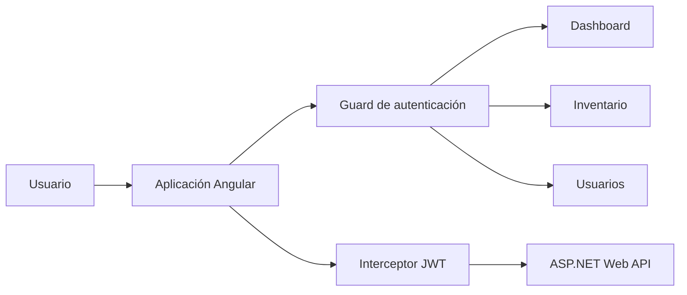

# Nexo Inventory — Frontend

Interfaz web para administrar activos, responsables y ubicaciones de una empresa. El proyecto nació como trabajo universitario y fue renovado como un caso de estudio full-stack orientado a portafolio.

> Este repositorio contiene el cliente Angular. La API se encuentra en [Back-ProyectoWebApi](https://github.com/itzlala/Back-ProyectoWebApi).

## Funcionalidades

- Inicio de sesión mediante JWT y cierre automático ante sesiones inválidas.
- Rutas privadas protegidas con `AuthGuard`.
- Dashboard con indicadores de disponibilidad, asignación y mantenimiento.
- Consulta, búsqueda, filtrado y paginación del inventario.
- Alta, edición y eliminación de activos.
- Directorio de usuarios con búsqueda y ordenamiento.
- Estados vacíos, mensajes de error y diseño responsive.

## Tecnologías

| Área | Tecnología |
| --- | --- |
| Framework | Angular 14 y TypeScript |
| UI | Angular Material y CSS responsive |
| Datos | HttpClient y RxJS |
| Seguridad | JWT, interceptor HTTP y session storage |
| Pruebas | Jasmine y Karma |

## Arquitectura



## Ejecución local

Requisitos: Node.js 16 o superior, npm y la API ejecutándose en `https://localhost:44319`.

```bash
npm ci
npm start
```

Abre `http://localhost:4200`. Para generar una compilación optimizada:

```bash
npm run build
```

La URL del backend se configura en `src/environments/environment.ts`; producción utiliza `/api` para permitir que frontend y API se publiquen bajo el mismo dominio.

## Flujo de autenticación

1. El formulario envía las credenciales únicamente a `POST /api/auth/login`.
2. La API valida la cuenta y devuelve un JWT firmado con expiración.
3. El cliente mantiene el token durante la pestaña activa y lo adjunta a cada solicitud.
4. Las respuestas `401` eliminan la sesión y regresan al acceso.

## Proyecto relacionado

- [API y documentación del backend](https://github.com/itzlala/Back-ProyectoWebApi)

## Autor

Proyecto académico y de portafolio desarrollado por [itzlala](https://github.com/itzlala).
